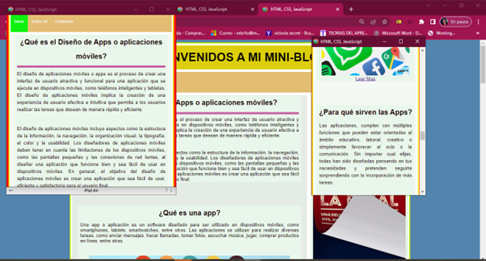
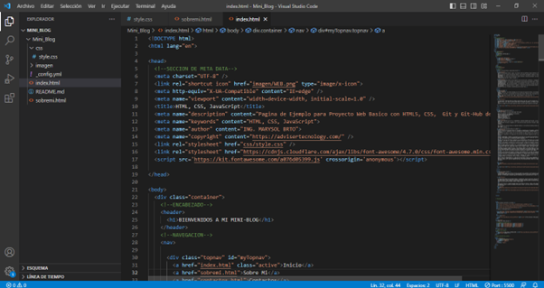

# Proyecto_Mini_Blog
Proyecto_Mini_Blog

### Creacion de un Sitio Web mini-blog con HTML5, CSS3, JAVASCRIPT, BOOTSTRAP, Git, Github Page,  Con Diseño Reponsive Escalable.

## URL DEL PROYECTO:

https://marysol-b02.github.io/Proyecto_Mini_Blog/
 
